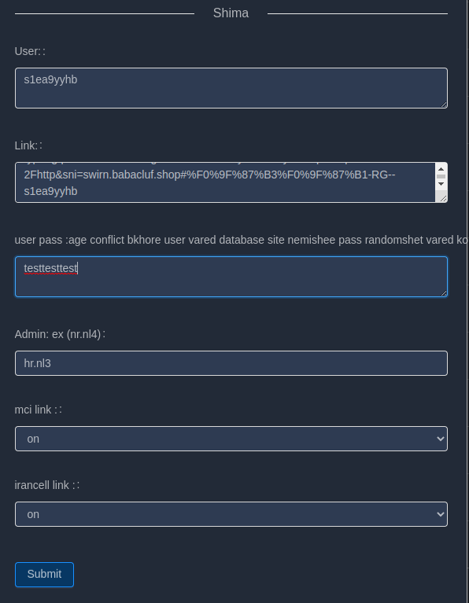
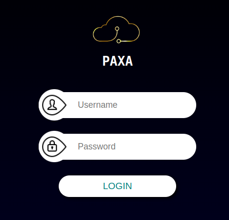
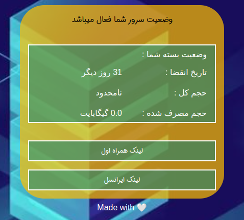

# x-ui-badguys

# Features

- Managing users with the least difficulty with PAXA
- System Status Monitoring
- Search within all inbounds and clients
- Support Dark/Light theme UI
- Support multi-user multi-protocol, web page visualization operation
- Supported protocols: vmess, vless, trojan, shadowsocks, dokodemo-door, socks, http
- Support for configuring more transport configurations
- Traffic statistics, limit traffic, limit expiration time
- Customizable xray configuration templates
- Support https access panel (self-provided domain name + ssl certificate)
- Support one-click SSL certificate application and automatic renewal
- For more advanced configuration items, please refer to the panel
- Fix api routes (user setting will create with api)
- Support to change configs by different items provided in panel

# CODE WITH 
Node - Go

# Developed By

- [hossein](https://github.com/hossein-rg)
- [majid](https://github.com/EzzMan)

# A Special Thanks To

- [alireza](https://github.com/alireza0/)
- [MHSanaei](https://github.com/MHSanaei)

# Beauty

